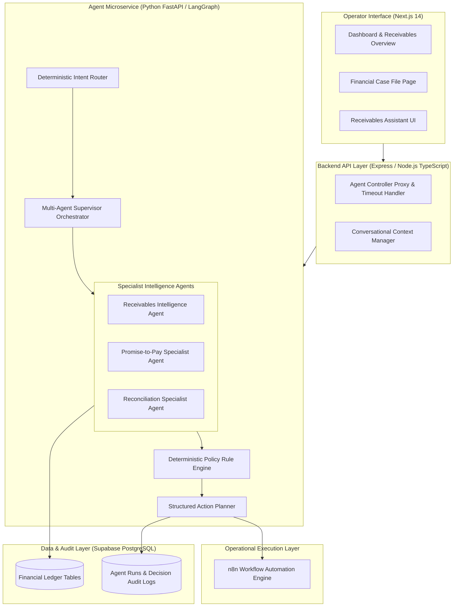
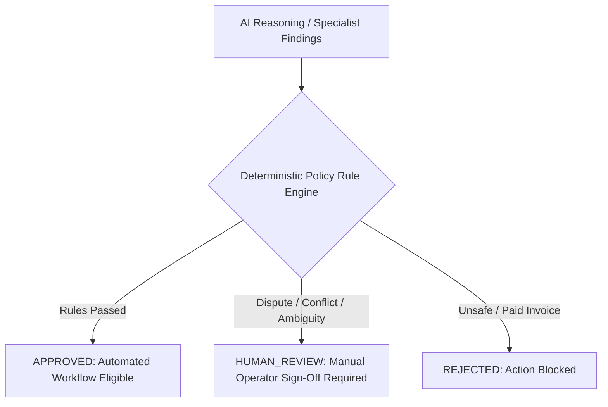
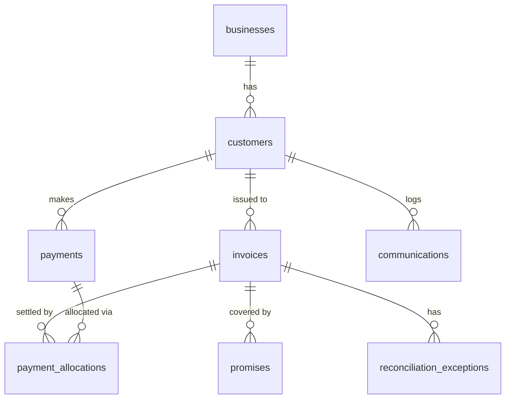

# AI Revenue Recovery & Receivables Intelligence Platform

> **An agentic financial operations platform for identifying overdue exposure, understanding customer commitments, diagnosing payment reconciliation issues, coordinating specialist intelligence, and safely planning recovery interventions.**

---

## 1. Executive Summary

Traditional financial operations software displays overdue invoices on static dashboards and leaves prioritization, customer follow-up, and discrepancy resolution to manual human effort. Rule-based systems trigger blunt reminders based solely on due dates without evaluating payment commitments, historical customer reliability, or underlying accounting exceptions.

The **AI Revenue Recovery & Receivables Intelligence Platform** is an enterprise-grade agentic financial co-pilot built to automate and coordinate B2B revenue recovery operations. The platform does not merely display data or predict payment probabilities—it:

1. **Detects Financial Risk**: Calculates deterministic exposure signals, overdue aging brackets, and priority scores across the entire receivables ledger.
2. **Diagnoses Underlying Problems**: Analyzes payment promises, fulfillment ratios, communication sentiment, and 4-level reconciliation evidence hierarchies.
3. **Selects Appropriate Specialists**: Routes complex requests to dedicated specialist agents or orchestrates cross-domain multi-agent investigations.
4. **Synthesizes Cross-Domain Evidence**: Detects conflicts between specialist findings (e.g., critical overdue priority vs. an active valid promise-to-pay) and applies deterministic arbitration rules.
5. **Enforces Policy Guardrails**: Mandates deterministic financial policy constraints, forcing human review for disputed, critical, or ambiguous cases.
6. **Plans Controlled Interventions**: Generates structured, policy-approved recovery action plans with explicit eligibility flags and execution requirements.
7. **Supports Operational Workflows**: Integrates with n8n operational workflow automation to execute approved email, task creation, or document request flows.
8. **Measures Recovery Outcomes**: Tracks closed-loop financial recovery using authoritative Supabase ledger state rather than superficial execution metrics.
9. **Records Complete Audit Trails**: Writes full graph state, execution traces, policy evaluations, and decision records to database audit tables.

---

## 2. Business Problem

Enterprise financial teams face immense friction in managing working capital due to fragmented accounting systems, uncoordinated customer communications, and manual discrepancy tracking.

### Core Challenges
- **Revenue Leakage**: Significant capital tied up in aged overdue accounts receivable without systematic, risk-adjusted collection strategies.
- **Unmanaged Broken Promises**: Inability to systematically track payment commitments made over phone or email versus actual bank settlements.
- **Accounting Discrepancies**: Payment stalls caused by unallocated Tax Deducted at Source (TDS), Goods and Services Tax (GST) rate differences, Merchant Discount Rate (MDR) fee deductions, and partial payments.
- **Operational Inefficiency**: Collection agents reaching out to customers who have open billing disputes or unresolved reconciliation exceptions, damaging buyer-seller relationships.

---

## 3. Real-World Revenue Leakage Problems

In high-volume B2B commerce, financial leakage occurs not because buyers refuse to pay, but because of operational disconnects between billing, collections, and cash application teams:

- **TDS Deduction Stalls**: Buyer deducts 10% TDS under Section 194C/194J but fails to provide Form 16A certificates, leaving open invoice balances.
- **GST Discrepancy Stalls**: Buyer holds payment because invoice tax rate (18%) differs from purchase order tax rate (12%).
- **Broken Promise Accumulation**: Buyer promises payment by the 15th of the month, fails to pay, and no automated system triggers escalation.
- **Unallocated Lump-Sum Payments**: Buyer pays ₹5,000,000 against 4 different invoices without remittance details, leaving individual invoices marked as unpaid.

---

## 4. Why Traditional Rules Fail

Traditional AR automation relies on hardcoded static rules:

```
IF days_overdue > 30 THEN send_dunning_letter
```

### Flaws of Static Rule-Based Systems
- **Ignorance of Active Commitments**: Triggers aggressive collection emails even if the customer promised to pay in 3 days.
- **Ignorance of Open Disputes**: Harasses customers who have already logged valid GST/TDS billing exceptions.
- **Lack of Multi-Domain Context**: A single invoice can be **₹4,500,000 outstanding**, **40 days overdue**, have an **ACTIVE payment promise** for ₹3,375,000 due in 9 days, and have an open **GST discrepancy**. A static rule cannot weigh these competing factors.

---

## 5. The Agentic Co-Pilot Approach

This platform replaces static rules and general-purpose LLM text generators with a **Stateful Multi-Agent Control Architecture**:

- **Stateful Workflows**: Agents operate as stateful LangGraph graphs, preserving context across multi-step execution cycles.
- **Specialized Intelligence**: Distinct specialist agents handle Receivables Risk, Promise-to-Pay (P2P), and Reconciliation Discrepancies.
- **Deterministic Policy Safety**: Every action proposal must pass hard deterministic Python policy rules (`RULE_1_PAID_INVOICE_HALT`, `RULE_2_CRITICAL_HUMAN_REVIEW_PRESERVATION`, `RULE_3_DISPUTED_INVOICE_PAUSE`, `RULE_4_CONFLICTING_EVIDENCE_SAFEGUARD`).
- **Separation of Reasoning & Side-Effects**: AI agents analyze and propose; Policy gates control; n8n executes operational side-effects; Supabase verifies financial outcomes.

---

## 6. High-Level System Architecture



---

## 7. Detailed Data Request Flow

When an operator queries: **"Why is INV-SYNTH-10002 still outstanding?"**

1. **API Ingestion**: Express Backend proxy receives `POST /api/agents/supervisor/run` with `{ query: "Why is INV-SYNTH-10002 still outstanding?", invoiceNumber: "INV-SYNTH-10002" }`.
2. **Intent & Entity Resolution**: Intent Router classifies intent as `CROSS_DOMAIN_INVESTIGATION` and extracts entity `INV-SYNTH-10002`.
3. **Dynamic Specialist Delegation**: Supervisor selects 3 specialist agents (`RECEIVABLES`, `P2P`, `RECONCILIATION`).
4. **Specialist Graph Execution**:
   - **Receivables Agent**: Computes invoice facts (₹4.5M balance, 40 days overdue) -> Priority score `CRITICAL`.
   - **P2P Agent**: Resolves active promise `c3fb7561-b0da-405a-a075-855df96c55b8` (₹3.375M due in 9 days) -> Promise state `ACTIVE`, assessment `RELIABLE`, historical reliability `MEDIUM`.
   - **Reconciliation Agent**: Analyzes ledger allocations -> Discrepancy hypothesis `GST` rate mismatch.
5. **Cross-Agent Synthesis**: Supervisor synthesizes findings and flags conflict between `CRITICAL` collection priority and an `ACTIVE` promise with open `GST` exception.
6. **Policy Engine Evaluation**: Enforces `RULE_2_CRITICAL_HUMAN_REVIEW_PRESERVATION` -> Decision `HUMAN_REVIEW`.
7. **Action Plan & Audit**: Action Planner constructs an eligible `CREATE_FINANCE_REVIEW_TASK` plan requiring operator sign-off and writes audit records to Supabase `agent_runs` and `agent_decisions` tables.

---

## 8. Specialist Intelligence Agents

| Agent | Core Responsibility | Key Inputs | Primary Outputs | Business Value |
| :--- | :--- | :--- | :--- | :--- |
| **Receivables Agent** | Overdue aging, exposure risk scoring, priority ranking | Invoices, Customers, Payments | Priority score (`CRITICAL`, `HIGH`), aging bracket, risk factors | Focuses collector time on high-exposure risk accounts |
| **P2P Agent** | Payment promise tracking, fulfillment ratio, commitment reliability | Promises, Payments, Allocations, Comms | Promise state (`ACTIVE`, `BROKEN`), fulfillment ratio, reliability badge | Prevents premature escalation on committed funds |
| **Reconciliation Agent** | Exception diagnosis, 4-level evidence hierarchy evaluation | Payments, Allocations, Invoices, Comms | Discrepancy hypothesis (`TDS`, `GST`, `PARTIAL`), confidence score | Resolves accounting friction blocking invoice closure |
| **Multi-Agent Supervisor** | Cross-domain orchestration, conflict detection, synthesis | Specialist Agent outputs | Executive summary, cross-agent findings, policy decision | Unifies domain insights into a cohesive operational verdict |

---

## 9. Multi-Agent Supervisor Orchestrator

- **Dynamic Routing**:
  - *"What did this customer promise to pay?"* -> Routes to **P2P Specialist**.
  - *"Are there short-payment discrepancies?"* -> Routes to **Reconciliation Specialist**.
  - *"Why is INV-SYNTH-10002 still outstanding?"* -> Triggers **Cross-Domain Investigation** (`RECEIVABLES` + `P2P` + `RECONCILIATION`).
- **Conflict Arbitration**: When Receivables demands `CRITICAL` collection escalation but P2P shows `ACTIVE` promise or Reconciliation shows open `GST` dispute, Supervisor preserves the stricter safety constraint (`HUMAN_REVIEW`).

---

## 10. Multi-Turn Conversational Context Architecture

- **Context Service**: Implemented in [`backend/src/services/assistantContext.service.ts`](file:///c:/Razorpay-Project/backend/src/services/assistantContext.service.ts).
- **Entity Anchoring**: Persists active `currentInvoiceId`, `currentCustomerId`, `currentPromiseId`, and `currentExceptionId` across conversation turns.
- **Context Override Hierarchy**:
  - *Turn 1*: "Why is INV-SYNTH-10002 important?" -> Anchors context to `INV-SYNTH-10002`.
  - *Turn 2*: "What did this customer promise to pay?" -> Resolves promise using anchored customer ID.
  - *Turn 3*: "What about INV-SYNTH-10008?" -> Explicit new invoice entity immediately overrides stale context.

---

## 11. Deterministic Policy Safety Engine



### Enforced Policy Rules
1. **`RULE_1_PAID_INVOICE_HALT`**: Halts all collection interventions if invoice balance is 0 or status is `PAID`.
2. **`RULE_2_CRITICAL_HUMAN_REVIEW_PRESERVATION`**: Preserves human review requirements from any specialist agent.
3. **`RULE_3_DISPUTED_INVOICE_PAUSE`**: Pauses automated dunning when an active dispute or open reconciliation exception is flagged.
4. **`RULE_4_CONFLICTING_EVIDENCE_SAFEGUARD`**: Forces human review if specialist agents report conflicting statuses.

---

## 12. Structured Action Planner

- **Module**: Implemented in [`agent-service/app/services/action_planner.py`](file:///c:/Razorpay-Project/agent-service/app/services/action_planner.py).
- **Action Plan Schema**: Returns strongly typed JSON containing `actionId`, `requestId`, `idempotencyKey`, `actionType`, `priority`, `channel`, `policyDecision`, `requiresApproval`, and `approvalStatus`.
- **Supported Action Types**:
  - `SEND_PAYMENT_REMINDER`
  - `REQUEST_TDS_DOCUMENT`
  - `ESCALATE_COLLECTION_CASE`
  - `CREATE_FINANCE_REVIEW_TASK`
  - `NOTIFY_OPERATOR`

---

## 13. n8n Operational Execution Layer

- **Architectural Boundary**: Separates AI reasoning from external operational side-effects.
- **Payload Contract**: Action Plans dispatch standardized payloads to n8n webhook runners (`POST /webhook/receivables-recovery`).
- **Safety Checks**: n8n runner validates human approval, checks idempotency keys, re-checks real-time Supabase financial ledger state (halts if invoice was paid/disputed), and logs execution audit records.
- **Execution Mode**: External n8n webhook dispatches are fully implemented with contract validation; live email sending operates in **SANDBOX / MOCK RUNNER** mode for safety.

---

## 14. Closed-Loop Recovery Outcome Measurement

Financial recovery is measured exclusively through authoritative Supabase ledger state:

$$\text{Recovery Rate (\%)} = \frac{\text{Sum of Verified Ledger Payment Allocations Post-Intervention}}{\text{Total Initial Overdue Exposure}} \times 100\%$$

- **Core Rule**: Communication delivery (email sent/opened) does **NOT** equal financial recovery. Recovery is verified only when bank account credit allocations are written to `payment_allocations`.

---

## 15. Database Architecture & Schema



---

## 16. Technology Stack

| Layer | Technology | Version | Purpose |
| :--- | :--- | :--- | :--- |
| **Frontend UI** | Next.js / React / TypeScript | `14.2.35` / `18.3.1` | Operator co-pilot dashboard & case file UI |
| **Backend API** | Node.js / Express / TypeScript | `4.19.2` / `5.4.5` | REST API, context management, proxy timeout handler |
| **Agent Microservice** | Python / FastAPI / Uvicorn | `3.13.7` / `0.115.0` | Agent graph execution endpoints & policy engine |
| **Agent Orchestration** | LangGraph / LangChain | `0.2.74` | Stateful multi-agent graph workflows |
| **Structured LLM** | Google Gemini 3.6 Flash | Gemini API | Contextual reasoning & structured output generation |
| **Database & Auth** | Supabase PostgreSQL / PostgREST | `@supabase/supabase-js 2.45.0` | Relational financial source of truth & audit storage |
| **Workflow Engine** | n8n Automation Engine | Workflows JSON | Operational action execution layer |
| **Testing** | Pytest / TypeScript Test Runners | Pytest `9.1.1` | Automated unit, semantic, and integration suites |

---

## 17. Technical Rationale

- **LangGraph**: Enables stateful multi-step cycles, conditional routing, and graph state persistence impossible with standard chain LLM calls.
- **FastAPI (Python)**: Provides high-performance async agent execution endpoints decoupled from Node API logic.
- **Express (Node.js)**: Acts as backend gateway, handling CORS, frontend context management, and proxy timeout configuration.
- **Supabase PostgreSQL**: Enforces ACID relational integrity required for financial ledgers and payment allocations.
- **Gemini 3.6 Flash**: Delivers rapid structured JSON generation for real-time operator co-pilot interactions.

---

## 18. Failure Handling & System Hardening

During development and testing, several real-world failure modes were encountered and systematically hardened:

1. **Transient Supabase Socket Read Failures (`WinError 10035`)**: Hardened in [`agent-service/app/services/supabase.py`](file:///c:/Razorpay-Project/agent-service/app/services/supabase.py) using custom `httpx.Client` timeouts (`connect=5.0s`, `read=15.0s`) and bounded exponential backoff retries (3 attempts: 0.2s, 0.4s, 0.8s).
2. **Node Express Proxy Timeouts**: Increased proxy socket timeout in [`backend/src/controllers/agent.controller.ts`](file:///c:/Razorpay-Project/backend/src/controllers/agent.controller.ts) from 2.5s to 30.0s for specialist agent runs, preserving structured Python JSON error bodies (`SERVICE_UNAVAILABLE`, `TIMEOUT`, `NOT_FOUND`).
3. **Non-UUID Database Syntax Errors (`22P02`)**: Added `is_valid_uuid()` validation in [`p2p_context.py`](file:///c:/Razorpay-Project/agent-service/app/services/p2p_context.py) and [`reconciliation_context.py`](file:///c:/Razorpay-Project/agent-service/app/services/reconciliation_context.py) to prevent invalid UUID database queries when resolving string invoice numbers.
4. **Early Graph Failure Routing**: Added `route_after_load_context` conditional edge in `reconciliation_graph.py` and `p2p_graph.py` to halt execution safely when context loading fails.

---

## 19. Security & Compliance

- **Credentials Management**: Environment variables stored in `.env` files (never committed to repository).
- **Service Isolation**: Node backend proxies requests to internal Python agent microservices (`http://127.0.0.1:8000`), hiding internal Python service endpoints from browser clients.
- **Database Security**: Private Supabase service role keys restricted to backend server runtime.
- **Audit Preservation**: Operational action executions cannot bypass policy evaluation or audit log insertion.

---

## 20. Human-in-the-Loop Safeguards

Human operator approval is strictly enforced for:

- High-exposure invoices (`CRITICAL` priority score).
- Active customer disputes or unallocated payment exceptions.
- Low evidence diagnostic confidence (<0.70).
- Conflicting findings between specialist agents.

---

## 21. Observability & Auditability

Every agent execution automatically writes immutable records to Supabase audit tables:

- `agent_runs`: Stores `request_id`, `agent_name`, `status`, `input_params`, `execution_time_ms`, and full `final_state` JSON.
- `agent_decisions`: Stores `decision_id`, `agent_run_id`, `policy_decision`, `policy_reason`, `rules_triggered`, `confidence`, and `recommended_action`.
- `audit_logs`: Stores system action events and operator approvals.

---

## 22. Verified Evaluation Test Metrics

Empirically verified evaluation numbers from automated test suite runs:

| Component / Test Suite | Test Scope | Cases Tested | Cases Passed | Pass Rate | Test Harness / Verification File |
| :--- | :--- | :--- | :--- | :--- | :--- |
| **Agent Microservice Pytest Suite** | Specialist graphs, policy rules, signals, hardening | **33** | **33** | **100.0%** | `pytest app/tests/` |
| **Case File Integration Suite** | Node proxy timeout, P2P, Supervisor, error responses | **7** | **7** | **100.0%** | `node dist/scripts/test_casefile_integration.js` |
| **Action & Recovery Flow Suite** | Action Planner, n8n runner, idempotency, ledger re-checks | **7** | **7** | **100.0%** | `node dist/scripts/test_action_recovery_flow.js` |
| **Assistant Semantic Router Suite** | Intent routing, multi-turn entity context, fallback handling | **32** | **30** | **93.8%** | `node dist/scripts/assistant_semantic_tests.js` |
| **Backend TypeScript Build** | Production TypeScript compilation | **1** | **1** | **100.0%** | `npm run build` (in `backend`) |
| **Frontend Next.js Build** | Production Next.js page compilation | **11 pages** | **11 pages** | **100.0%** | `npm run build` (in `frontend`) |

---

## 23. Real End-to-End Case Study: `INV-SYNTH-10002`

- **Database Financial State**:
  - Customer: **Trident Enterprises 001**
  - Invoice Amount: **₹4,500,000**
  - Outstanding Amount: **₹4,500,000**
  - Days Overdue: **40 Days**
- **Receivables Specialist Findings**: Computes overdue exposure & aging -> Assigns `CRITICAL` collection priority score.
- **P2P Specialist Findings**: Ingests active promise `c3fb7561-b0da-405a-a075-855df96c55b8` (₹3,375,000 due 2026-09-08) -> Promise state `ACTIVE`, promise assessment `RELIABLE`, historical commitment reliability `MEDIUM`.
- **Reconciliation Specialist Findings**: Analyzes ledger allocations -> Identifies `GST` tax rate discrepancy hypothesis.
- **Supervisor Synthesis**: Synthesizes findings across domain specialists and flags conflict between `CRITICAL` overdue priority and `ACTIVE` promise with open `GST` dispute.
- **Policy Engine Gate**: Applies `RULE_2_CRITICAL_HUMAN_REVIEW_PRESERVATION` -> Decision `HUMAN_REVIEW` (Reason: Active invoice dispute detected).
- **Action Plan Output**: Generates eligible `CREATE_FINANCE_REVIEW_TASK` plan with `requiresApproval = true` and `idempotencyKey = REM-INV-SYNTH-10002-20260830`.
- **Execution & Audit Result**: Executes controlled n8n runner dispatch with operator sign-off -> Logs execution run `96151a82-97ac-4bef-92eb-00f5b9191af3` to Supabase `agent_runs` and `agent_decisions` tables.

---

## 24. Supported Edge Scenarios

- Fully paid invoice (0 balance) -> Action Planner and n8n runner immediately halt execution (`RULE_1_PAID_INVOICE_HALT`).
- Active broken promise history -> Customer commitment reliability badge set to `LOW`.
- Non-existent lookup ID -> Returns clean HTTP 404 response without application crash.
- Ambiguous multi-promise query -> Assistant router prompts operator for promise clarification.

---

## 25. Repository Structure

```
Razorpay-Project/
│
├── frontend/                                   # Operator-Facing Web Application (Next.js 14 / React 18 / TypeScript)
│   ├── src/
│   │   ├── app/                                # App Router Page Routes
│   │   │   ├── page.tsx                        # Overview Executive Dashboard
│   │   │   ├── assistant/page.tsx              # Receivables Operations Copilot Chat Interface
│   │   │   ├── invoices/page.tsx               # Invoices Directory & Filter Table
│   │   │   ├── invoices/[id]/page.tsx          # Financial Case File Workspace Page
│   │   │   ├── receivables/page.tsx            # Receivables Management & Priority Queue
│   │   │   ├── commitments/page.tsx            # Promise-to-Pay Workspace
│   │   │   ├── reconciliation/page.tsx         # Reconciliation Exception Workspace
│   │   │   ├── customers/page.tsx              # Customer Accounts Directory
│   │   │   ├── customers/[id]/page.tsx         # Customer Account Profile View
│   │   │   ├── activity/page.tsx               # Audit & System Activity Feed
│   │   │   └── layout.tsx                      # Root Application Layout & Navigation Sidebar
│   │   │
│   │   ├── components/                         # Co-Pilot & Case File UI Components
│   │   │   ├── ChatbotShell.tsx                # Receivables Operations Copilot UI Component
│   │   │   ├── PromiseIntelligenceCard.tsx     # Promise-to-Pay Specialist UI Card Component
│   │   │   ├── ReconciliationIntelligenceCard.tsx # Reconciliation Specialist UI Card Component
│   │   │   ├── SupervisorIntelligenceCard.tsx  # Multi-Agent Supervisor Orchestrator UI Card Component
│   │   │   ├── InvoiceDetail.tsx               # Single Invoice Financial Case File Working View
│   │   │   ├── DashboardMetrics.tsx            # Portfolio Overview Metric Summary Cards
│   │   │   ├── ReceivablesTable.tsx            # Receivables Priority Table Component
│   │   │   ├── ReceivableDetailDrawer.tsx      # Quick-Inspect Receivable Drawer
│   │   │   ├── PaymentCommitmentsSection.tsx   # Promise-to-Pay Commitment List Panel
│   │   │   ├── PaymentExceptionsSection.tsx    # Reconciliation Discrepancy Exception Panel
│   │   │   ├── SystemActivityTimeline.tsx      # Audit Log Event Timeline Component
│   │   │   ├── WhyNeedsAttentionPanel.tsx      # Case File Attention Priority Explanation Panel
│   │   │   ├── Header.tsx                      # Application Top Navigation Header
│   │   │   ├── Sidebar.tsx                     # Primary Application Navigation Bar
│   │   │   └── receivables/
│   │   │       └── PriorityBadge.tsx           # Collection Priority Badge (CRITICAL, HIGH, MEDIUM, LOW)
│   │   │
│   │   ├── lib/
│   │   │   └── api.ts                          # Backend Gateway API Client & Fetch Helpers
│   │   │
│   │   └── types/
│   │       └── index.ts                        # TypeScript Data Models & Contract Schemas
│   │
│   ├── package.json                            # Frontend Node Dependencies & Scripts
│   ├── next.config.mjs                         # Next.js Framework Configuration
│   ├── tailwind.config.ts                      # Tailwind Styling & UI Theme Tokens
│   └── tsconfig.json                           # Frontend TypeScript Configuration
│
├── backend/                                    # Express API Gateway & Context Gateway (Node.js / TypeScript)
│   ├── src/
│   │   ├── server.ts                           # Express Server Entry Point (Port 5000)
│   │   │
│   │   ├── routes/                             # Gateway API Route Handlers
│   │   │   ├── agent.routes.ts                 # Agent, Action Planner & Outcome Endpoint Routes
│   │   │   ├── invoice.routes.ts               # Invoice Working View & Detail Routes
│   │   │   ├── customer.routes.ts              # Customer Profile & Portfolio Routes
│   │   │   ├── business.routes.ts              # Merchant Entity Routes
│   │   │   ├── dashboard.routes.ts             # Dashboard Summary & Aggregation Routes
│   │   │   └── health.routes.ts                # Service Health Check Endpoint (`/api/health`)
│   │   │
│   │   ├── controllers/                        # Express API Controllers & Proxy Logic
│   │   │   ├── agent.controller.ts             # Agent Microservice Proxy & 30s Timeout Handler
│   │   │   ├── invoice.controller.ts           # Invoice Data Query Controller
│   │   │   ├── customer.controller.ts          # Customer Account Query Controller
│   │   │   ├── business.controller.ts          # Merchant Entity Query Controller
│   │   │   └── dashboard.controller.ts         # Portfolio Dashboard Summary Controller
│   │   │
│   │   ├── services/                           # Gateway Core Services
│   │   │   ├── assistantContext.service.ts     # Multi-Turn Conversational Entity Anchoring Context Manager
│   │   │   └── database.service.ts             # Supabase PostgreSQL Service Client
│   │   │
│   │   └── scripts/                            # Integration & Semantic Test Suites
│   │       ├── assistant_semantic_tests.ts     # 32-Scenario Assistant Semantic Router Evaluation Suite
│   │       ├── test_casefile_integration.ts    # 7-Scenario Case File Node Proxy Integration Suite
│   │       ├── test_action_recovery_flow.ts    # 7-Scenario Action Planner & Recovery Outcome Test Suite
│   │       ├── test_matrix.ts                  # Comprehensive Matrix Evaluation Runner Script
│   │       ├── audit_database.ts               # Database Audit Log Inspection Utility Script
│   │       ├── check_agent_tables.ts           # Agent Runs & Decisions Table Inspector Script
│   │       └── introspect_schema.ts            # Supabase Schema Introspection Utility Script
│   │
│   ├── package.json                            # Backend Node Dependencies & Build Scripts
│   └── tsconfig.json                           # Backend TypeScript Compiler Options
│
├── agent-service/                              # Python Agent Microservice (Python 3.13 / FastAPI / LangGraph)
│   ├── main.py                                 # FastAPI Microservice Entry Point (Port 8000)
│   │
│   ├── app/
│   │   ├── api/                                # FastAPI HTTP Endpoint Routers
│   │   │   ├── receivables.py                  # Receivables Agent Endpoint (`POST /agents/receivables/run`)
│   │   │   ├── p2p.py                          # Promise-to-Pay Agent Endpoint (`POST /agents/promises/run`)
│   │   │   ├── reconciliation_api.py           # Reconciliation Agent Endpoint (`POST /agents/reconciliation/run`)
│   │   │   ├── supervisor_api.py               # Multi-Agent Supervisor Endpoint (`POST /agents/supervisor/run`)
│   │   │   └── action_api.py                   # Action Planner & Outcome Endpoints (`POST /actions/*`)
│   │   │
│   │   ├── graph/                              # LangGraph Stateful Workflow Graphs
│   │   │   ├── receivables_graph.py            # Receivables Intelligence LangGraph Workflow
│   │   │   ├── p2p_graph.py                    # Promise-to-Pay Specialist LangGraph Workflow
│   │   │   ├── reconciliation_graph.py         # Reconciliation Specialist LangGraph Workflow
│   │   │   └── supervisor_graph.py             # Multi-Agent Supervisor Orchestrator LangGraph Workflow
│   │   │
│   │   ├── nodes/                              # LangGraph Execution Nodes
│   │   │   ├── receivables_nodes.py            # Receivables Aging, Risk & Reasoning Graph Nodes
│   │   │   ├── p2p_nodes.py                    # P2P Context Loading, Signals, Evaluation & Audit Nodes
│   │   │   ├── reconciliation_nodes.py         # Reconciliation Context, Discrepancy & Audit Graph Nodes
│   │   │   └── supervisor_nodes.py             # Supervisor Intent, Specialist Call & Synthesis Nodes
│   │   │
│   │   ├── services/                           # Python Business Intelligence & Supabase Services
│   │   │   ├── action_planner.py               # Generates ActionPlans with Eligibility & Safety Checks
│   │   │   ├── n8n_workflow_engine.py          # Controlled n8n Recovery Workflow Runner (Sandbox/Mock Mode)
│   │   │   ├── outcome_tracker.py              # Financial Recovery Outcome Engine (Supabase Ledger Allocations)
│   │   │   ├── supervisor_intent.py            # Intent Router & Multi-Turn Query Entity Resolver
│   │   │   ├── supervisor_synthesis.py         # Supervisor Cross-Domain Synthesis & Conflict Resolution
│   │   │   ├── receivables_evaluator.py        # Receivables Financial Exposure Risk Evaluator
│   │   │   ├── p2p_context.py                  # P2P Context Loader (Promises, Invoices, Payments)
│   │   │   ├── p2p_evaluator.py                # P2P Fulfillment & Commitment Reliability Evaluator
│   │   │   ├── p2p_reliability.py              # Customer Historical Commitment Reliability Score Engine
│   │   │   ├── p2p_signals.py                  # Deterministic Promise Signal Extraction Engine
│   │   │   ├── reconciliation_context.py       # Reconciliation Context Loader (Exceptions, Allocations)
│   │   │   ├── reconciliation_evaluator.py     # Discrepancy Amount & Financial Valuation Evaluator
│   │   │   ├── reconciliation_hypothesis.py    # 4-Level Evidence Discrepancy Hypothesis Builder (TDS, GST)
│   │   │   ├── reconciliation_signals.py       # Reconciliation Signal Extraction & Matching Engine
│   │   │   ├── context.py                      # General Receivables Context Aggregator
│   │   │   ├── portfolio.py                    # Portfolio Summary & Ranking Aggregator
│   │   │   ├── signals.py                      # Receivables Aging & Risk Signal Extractor
│   │   │   ├── gemini.py                       # Google Gemini 3.6 Flash Structured Output API Client
│   │   │   ├── grounding.py                    # Financial Fact Grounding Verification Engine
│   │   │   └── supabase.py                     # Bounded-Retry Supabase Client (`WinError 10035` Hardened)
│   │   │
│   │   ├── policies/                           # Hard Deterministic Python Policy Engines
│   │   │   ├── receivables_policy.py           # Receivables Risk Policy Rule Engine
│   │   │   ├── p2p_policy.py                   # Promise-to-Pay Policy Rule Engine
│   │   │   ├── reconciliation_policy.py        # Reconciliation Exception Policy Rule Engine
│   │   │   └── supervisor_policy.py            # Supervisor Cross-Agent Arbitration Policy Rule Engine
│   │   │
│   │   ├── state/                              # Typed LangGraph Agent State Schemas
│   │   │   ├── receivables_state.py            # Receivables Agent State Definition
│   │   │   ├── p2p_state.py                    # P2P Specialist Agent State Definition
│   │   │   ├── reconciliation_state.py         # Reconciliation Specialist Agent State Definition
│   │   │   └── supervisor_state.py             # Multi-Agent Supervisor State Definition
│   │   │
│   │   └── tests/                              # Pytest Automated Specialist Test Suite
│   │       ├── test_graph.py                   # Graph Execution Cycle Unit Tests (4 Scenarios)
│   │       ├── test_p2p_hardening.py           # P2P Supabase Network Hardening Tests (10 Scenarios)
│   │       ├── test_policy.py                  # Policy Rule Engine Unit Tests (10 Scenarios)
│   │       └── test_signals.py                 # Deterministic Signal Extraction Unit Tests (9 Scenarios)
│   │
│   └── requirements.txt                        # Python Library Dependencies (FastAPI, LangGraph, etc.)
│
├── database/                                   # Supabase PostgreSQL Database Schema, Views & Seeds
│   ├── schema/
│   │   └── 01_tables.sql                       # PostgreSQL DDL Schema (Ledgers, Promises, Audit Logs)
│   ├── views/
│   │   └── 01_invoice_working_view.sql         # SQL Working View Definition (`invoice_working_view`)
│   └── seeds/
│       └── 01_seed_data.sql                    # Baseline Synthetic B2B Data Seed Script
│
├── docs/                                       # Technical Specifications, Design Docs & Evaluation Reports
│   ├── ACTION_PLANNER_DESIGN.md               # Action Planner Architecture & Eligibility Design Spec
│   ├── AGENT_ARCHITECTURE_MIGRATION.md         # LangGraph Multi-Agent Architecture Migration Report
│   ├── API.md                                  # REST API Endpoint Documentation
│   ├── ARCHITECTURE.md                         # System Architecture Overview
│   ├── ASSISTANT_CONVERSATIONAL_CONTEXT.md     # Multi-Turn Conversational Context Design Spec
│   ├── ASSISTANT_EVALUATION.md                 # 32-Scenario Assistant Semantic Router Evaluation Report
│   ├── DATABASE.md                             # Database Schema & Relationship Documentation
│   ├── DATABASE_AUDIT.md                       # Database Audit Trail & Audit Logging Architecture Spec
│   ├── DATASET_EXPANSION_PLAN.md               # 1,000-Invoice Synthetic Dataset Expansion Design Spec
│   ├── FINAL_AGENT_EVALUATION.md               # Summary Report of Agent Performance Metrics
│   ├── FINANCIAL_CASE_FILE.md                  # Financial Case File Working View Design Spec
│   ├── GEMINI_EXECUTION_TRACE.md               # Gemini LLM Structured Call Traces
│   ├── LANGGRAPH_RECEIVABLES_WORKFLOW.md       # Receivables Agent LangGraph Design Spec
│   ├── N8N_RECOVERY_WORKFLOW.md                # n8n Operational Execution Workflow Spec
│   ├── P2P_AGENT.md                            # P2P Agent High-Level Overview
│   ├── P2P_AGENT_DESIGN.md                     # P2P Agent Detailed Design & State Architecture
│   ├── P2P_AGENT_EVALUATION.md                 # P2P Agent Evaluation Metric Benchmark Report
│   ├── PORTFOLIO_AGENT_EVALUATION.md           # Portfolio Summary Agent Benchmark Report
│   ├── PORTFOLIO_AGENT_TRACE.md                # Portfolio Query Tracing Analysis
│   ├── RECEIVABLES_AGENT.md                    # Receivables Agent Overview
│   ├── RECEIVABLES_AGENT_DESIGN.md             # Receivables Agent Graph & Node Design Spec
│   ├── RECEIVABLES_AGENT_EVALUATION.md         # Receivables Agent Benchmark Metric Report
│   ├── RECEIVABLES_AGENT_SIGNALS.md            # Receivables Aging & Exposure Signal Spec
│   ├── RECEIVABLES_POLICY.md                   # Receivables Risk Policy Specification
│   ├── RECONCILIATION_AGENT.md                 # Reconciliation Agent Overview
│   ├── RECONCILIATION_AGENT_DESIGN.md          # Reconciliation Graph & 4-Level Evidence Hierarchy Spec
│   ├── RECONCILIATION_AGENT_EVALUATION.md      # Reconciliation Agent Benchmark Metric Report
│   ├── RECONCILIATION_AGENT_HARDENING.md       # Reconciliation Agent Hardening Report
│   ├── RECOVERY_WORKFLOW_EVALUATION.md         # Recovery Workflow Evaluation Report
│   ├── SETUP.md                                # Local Development Environment Setup Guide
│   ├── SUPERVISOR_DESIGN.md                    # Multi-Agent Supervisor Orchestrator Design Spec
│   └── SUPERVISOR_EVALUATION.md                # Supervisor Cross-Domain Benchmark Evaluation Report
│
├── PROJECT_PLAN.md                             # Project Milestone Execution Plan
├── README.md                                   # Root Documentation (Audit-Grade Architecture Specification)
├── package.json                                # Workspace Root Node Package Configuration
├── .env.example                                # Environment Configuration Variable Template
└── .gitignore                                  # Git Repository Exclusion Pattern Rules
```

---

### Architecture Component $\rightarrow$ Code Traceability

| Architecture Component | Actual Code Implementation | Automated Tests | Documentation |
| :--- | :--- | :--- | :--- |
| **Operator Co-Pilot UI** | [`frontend/src/app/assistant/page.tsx`](file:///c:/Razorpay-Project/frontend/src/app/assistant/page.tsx)<br>[`frontend/src/components/ChatbotShell.tsx`](file:///c:/Razorpay-Project/frontend/src/components/ChatbotShell.tsx) | Next.js Build (`npm run build`) | [`docs/ASSISTANT_CONVERSATIONAL_CONTEXT.md`](file:///c:/Razorpay-Project/docs/ASSISTANT_CONVERSATIONAL_CONTEXT.md) |
| **Financial Case File UI** | [`frontend/src/app/invoices/[id]/page.tsx`](file:///c:/Razorpay-Project/frontend/src/app/invoices/[id]/page.tsx)<br>[`frontend/src/components/InvoiceDetail.tsx`](file:///c:/Razorpay-Project/frontend/src/components/InvoiceDetail.tsx) | Integration Suite (`test_casefile_integration.js`) | [`docs/FINANCIAL_CASE_FILE.md`](file:///c:/Razorpay-Project/docs/FINANCIAL_CASE_FILE.md) |
| **Backend Express Gateway** | [`backend/src/server.ts`](file:///c:/Razorpay-Project/backend/src/server.ts)<br>[`backend/src/controllers/agent.controller.ts`](file:///c:/Razorpay-Project/backend/src/controllers/agent.controller.ts) | TypeScript Build (`tsc`) | [`docs/API.md`](file:///c:/Razorpay-Project/docs/API.md) |
| **Conversational Context Manager** | [`backend/src/services/assistantContext.service.ts`](file:///c:/Razorpay-Project/backend/src/services/assistantContext.service.ts) | Semantic Router Suite (`assistant_semantic_tests.js`) | [`docs/ASSISTANT_CONVERSATIONAL_CONTEXT.md`](file:///c:/Razorpay-Project/docs/ASSISTANT_CONVERSATIONAL_CONTEXT.md) |
| **Multi-Agent Supervisor** | [`agent-service/app/graph/supervisor_graph.py`](file:///c:/Razorpay-Project/agent-service/app/graph/supervisor_graph.py)<br>[`agent-service/app/services/supervisor_intent.py`](file:///c:/Razorpay-Project/agent-service/app/services/supervisor_intent.py) | Integration Suite (`test_casefile_integration.js`) | [`docs/SUPERVISOR_DESIGN.md`](file:///c:/Razorpay-Project/docs/SUPERVISOR_DESIGN.md) |
| **Receivables Intelligence Agent** | [`agent-service/app/graph/receivables_graph.py`](file:///c:/Razorpay-Project/agent-service/app/graph/receivables_graph.py)<br>[`agent-service/app/services/signals.py`](file:///c:/Razorpay-Project/agent-service/app/services/signals.py) | Pytest Suite (`pytest app/tests/`) | [`docs/RECEIVABLES_AGENT_DESIGN.md`](file:///c:/Razorpay-Project/docs/RECEIVABLES_AGENT_DESIGN.md) |
| **Promise-to-Pay Specialist** | [`agent-service/app/graph/p2p_graph.py`](file:///c:/Razorpay-Project/agent-service/app/graph/p2p_graph.py)<br>[`agent-service/app/services/p2p_evaluator.py`](file:///c:/Razorpay-Project/agent-service/app/services/p2p_evaluator.py) | Pytest Suite (`test_p2p_hardening.py`) | [`docs/P2P_AGENT_DESIGN.md`](file:///c:/Razorpay-Project/docs/P2P_AGENT_DESIGN.md) |
| **Reconciliation Specialist** | [`agent-service/app/graph/reconciliation_graph.py`](file:///c:/Razorpay-Project/agent-service/app/graph/reconciliation_graph.py)<br>[`agent-service/app/services/reconciliation_hypothesis.py`](file:///c:/Razorpay-Project/agent-service/app/services/reconciliation_hypothesis.py) | Pytest Suite (`test_policy.py`) | [`docs/RECONCILIATION_AGENT_DESIGN.md`](file:///c:/Razorpay-Project/docs/RECONCILIATION_AGENT_DESIGN.md) |
| **Deterministic Policy Engine** | [`agent-service/app/policies/`](file:///c:/Razorpay-Project/agent-service/app/policies/) | Pytest Suite (`test_policy.py`) | [`docs/RECEIVABLES_POLICY.md`](file:///c:/Razorpay-Project/docs/RECEIVABLES_POLICY.md) |
| **Structured Action Planner** | [`agent-service/app/services/action_planner.py`](file:///c:/Razorpay-Project/agent-service/app/services/action_planner.py)<br>[`agent-service/app/api/action_api.py`](file:///c:/Razorpay-Project/agent-service/app/api/action_api.py) | Action & Recovery Suite (`test_action_recovery_flow.js`) | [`docs/ACTION_PLANNER_DESIGN.md`](file:///c:/Razorpay-Project/docs/ACTION_PLANNER_DESIGN.md) |
| **n8n Workflow Runner** | [`agent-service/app/services/n8n_workflow_engine.py`](file:///c:/Razorpay-Project/agent-service/app/services/n8n_workflow_engine.py) | Action & Recovery Suite (`test_action_recovery_flow.js`) | [`docs/N8N_RECOVERY_WORKFLOW.md`](file:///c:/Razorpay-Project/docs/N8N_RECOVERY_WORKFLOW.md) |
| **Outcome Tracking Engine** | [`agent-service/app/services/outcome_tracker.py`](file:///c:/Razorpay-Project/agent-service/app/services/outcome_tracker.py) | Action & Recovery Suite (`test_action_recovery_flow.js`) | [`docs/RECOVERY_WORKFLOW_EVALUATION.md`](file:///c:/Razorpay-Project/docs/RECOVERY_WORKFLOW_EVALUATION.md) |
| **Authoritative Ledger Data** | [`database/schema/01_tables.sql`](file:///c:/Razorpay-Project/database/schema/01_tables.sql)<br>[`database/seeds/01_seed_data.sql`](file:///c:/Razorpay-Project/database/seeds/01_seed_data.sql) | Pytest & Integration Tests | [`docs/DATABASE.md`](file:///c:/Razorpay-Project/docs/DATABASE.md) |
| **Audit Logs & Execution Trace** | Supabase `agent_runs`, `agent_decisions`, `audit_logs` | Audit script (`audit_database.ts`) | [`docs/DATABASE_AUDIT.md`](file:///c:/Razorpay-Project/docs/DATABASE_AUDIT.md) |

---

### Request-Flow $\rightarrow$ Code Traceability

| Stage | Execution File(s) | Function / Method |
| :--- | :--- | :--- |
| **1. User Request Ingestion** | [`frontend/src/components/ChatbotShell.tsx`](file:///c:/Razorpay-Project/frontend/src/components/ChatbotShell.tsx)<br>[`frontend/src/lib/api.ts`](file:///c:/Razorpay-Project/frontend/src/lib/api.ts) | `runSupervisorAgent()` / `fetchJson()` |
| **2. Node API Gateway & Timeout Proxy** | [`backend/src/routes/agent.routes.ts`](file:///c:/Razorpay-Project/backend/src/routes/agent.routes.ts)<br>[`backend/src/controllers/agent.controller.ts`](file:///c:/Razorpay-Project/backend/src/controllers/agent.controller.ts) | `AgentController.runSupervisorAgent()` (`postJsonToPython` 30s timeout) |
| **3. Conversational Context Resolution** | [`backend/src/services/assistantContext.service.ts`](file:///c:/Razorpay-Project/backend/src/services/assistantContext.service.ts) | `resolveAssistantContext()` |
| **4. Intent Router & Entity Resolution** | [`agent-service/app/services/supervisor_intent.py`](file:///c:/Razorpay-Project/agent-service/app/services/supervisor_intent.py)<br>[`agent-service/app/nodes/supervisor_nodes.py`](file:///c:/Razorpay-Project/agent-service/app/nodes/supervisor_nodes.py) | `route_supervisor_intent_node()` |
| **5. Specialist Agent Execution** | [`agent-service/app/graph/receivables_graph.py`](file:///c:/Razorpay-Project/agent-service/app/graph/receivables_graph.py)<br>[`agent-service/app/graph/p2p_graph.py`](file:///c:/Razorpay-Project/agent-service/app/graph/p2p_graph.py)<br>[`agent-service/app/graph/reconciliation_graph.py`](file:///c:/Razorpay-Project/agent-service/app/graph/reconciliation_graph.py) | `receivables_graph.invoke()` / `p2p_graph.invoke()` / `reconciliation_graph.invoke()` |
| **6. Cross-Agent Synthesis & Conflict Detection** | [`agent-service/app/services/supervisor_synthesis.py`](file:///c:/Razorpay-Project/agent-service/app/services/supervisor_synthesis.py)<br>[`agent-service/app/nodes/supervisor_nodes.py`](file:///c:/Razorpay-Project/agent-service/app/nodes/supervisor_nodes.py) | `synthesize_specialist_results_node()` |
| **7. Policy Safety Engine Gate** | [`agent-service/app/policies/supervisor_policy.py`](file:///c:/Razorpay-Project/agent-service/app/policies/supervisor_policy.py) | `evaluate_supervisor_policy_rules()` |
| **8. Structured Action Planner** | [`agent-service/app/services/action_planner.py`](file:///c:/Razorpay-Project/agent-service/app/services/action_planner.py) | `generate_action_plan()` |
| **9. n8n Operational Execution Runner** | [`agent-service/app/services/n8n_workflow_engine.py`](file:///c:/Razorpay-Project/agent-service/app/services/n8n_workflow_engine.py) | `execute_n8n_recovery_workflow()` |
| **10. Ledger Outcome Measurement** | [`agent-service/app/services/outcome_tracker.py`](file:///c:/Razorpay-Project/agent-service/app/services/outcome_tracker.py) | `track_financial_outcome()` |
| **11. Audit Logging** | [`agent-service/app/services/supabase.py`](file:///c:/Razorpay-Project/agent-service/app/services/supabase.py)<br>[`agent-service/app/nodes/p2p_nodes.py`](file:///c:/Razorpay-Project/agent-service/app/nodes/p2p_nodes.py) | `persist_decision_node()` / `audit_logs.insert()` |

---

### Repository Documentation Consistency Check

1. **n8n Workflow Execution Mode**: `IMPLEMENTED (SANDBOX / MOCK RUNNER)`. External n8n webhook contracts, idempotency verification, real-time ledger re-checks, and audit logging are fully implemented and tested; live SMTP/Slack communication dispatch operates in sandbox/mock mode for safety.
2. **Outcome Recovery Measurement**: `IMPLEMENTED + VERIFIED`. Recovery measurements are calculated strictly against authoritative Supabase PostgreSQL payment allocations (`payment_allocations` table), enforcing the principle: *Email delivery $\neq$ Money recovered*.
3. **Policy Gate Enforcement**: `IMPLEMENTED + VERIFIED`. Every action proposal must pass through deterministic Python policy rules (`RULE_1_PAID_INVOICE_HALT`, `RULE_2_CRITICAL_HUMAN_REVIEW_PRESERVATION`, `RULE_3_DISPUTED_INVOICE_PAUSE`, `RULE_4_CONFLICTING_EVIDENCE_SAFEGUARD`). Neither Gemini nor n8n can bypass policy gates.
```

---

## 26. Quick Start Guide

### Prerequisites
- Node.js `v20+` & `npm`
- Python `3.11+` & `pip`
- Active Supabase PostgreSQL instance with schema & seed data applied

### 1. Start Python Agent Microservice
```bash
cd agent-service
python -m venv venv
.\venv\Scripts\activate
pip install -r requirements.txt
uvicorn main:app --host 127.0.0.1 --port 8000 --reload
```

### 2. Start Node.js Express Gateway
```bash
cd backend
npm install
npm run build
npm start
```

### 3. Start Next.js Frontend UI
```bash
cd frontend
npm install
npm run dev
```
Open [http://localhost:3000](http://localhost:3000) in your browser.

---

## 27. Core API Endpoint Overview

| Endpoint | Method | Service | Purpose |
| :--- | :--- | :--- | :--- |
| `/health` | `GET` | Agent / Backend | Service health status check |
| `/api/agents/promises/run` | `POST` | Node Gateway | Runs P2P Specialist Agent |
| `/api/agents/reconciliation/run` | `POST` | Node Gateway | Runs Reconciliation Specialist Agent |
| `/api/agents/receivables/run` | `POST` | Node Gateway | Runs Receivables Intelligence Agent |
| `/api/agents/supervisor/run` | `POST` | Node Gateway | Runs Multi-Agent Supervisor Orchestrator |
| `/api/agents/actions/plan` | `POST` | Node Gateway | Generates structured Action Plan |
| `/api/agents/actions/execute` | `POST` | Node Gateway | Executes operational recovery workflow via n8n runner |
| `/api/agents/actions/outcome` | `POST` | Node Gateway | Measures recovery outcome from Supabase ledger |

---

## 28. How a Judge Can Verify the System

To verify system functionality step-by-step:

1. **Open Dashboard**: Navigate to `http://localhost:3000` to view portfolio receivables summary and exposure cards.
2. **Inspect Case File**: Click on invoice `INV-SYNTH-10002` to open the **Financial Case File**.
3. **Run P2P Specialist**: Switch to **Promise-to-Pay Specialist** tab -> Click *Run Promise Intelligence Analysis* -> Verify live DB promise facts, fulfillment progress, and policy badge (`HUMAN REVIEW REQUIRED`).
4. **Run Supervisor**: Switch to **Multi-Agent Supervisor** tab -> Click *Run Supervisor Investigation* -> Verify cross-domain findings across Receivables, P2P, and Reconciliation.
5. **Test Co-Pilot Assistant**: Navigate to `/assistant` -> Type *"Why is INV-SYNTH-10002 important?"* followed by *"What did they promise?"* -> Verify multi-turn conversational context preservation.
6. **Run Action & Recovery Suite**: Execute `cd backend && node dist/scripts/test_action_recovery_flow.js` -> Verify all 7 action & outcome tests pass.
7. **Run Pytest Suite**: Execute `cd agent-service && .\venv\Scripts\pytest.exe app/tests/` -> Verify all 33 Python unit/hardening tests pass.

---

## 29. Implementation Capability Matrix

| Capability | Implementation Status | Evidence / Verification Location |
| :--- | :--- | :--- |
| **Receivables Intelligence Agent** | `IMPLEMENTED + VERIFIED` | `agent-service/app/graph/receivables_graph.py` |
| **Promise-to-Pay Specialist Agent** | `IMPLEMENTED + VERIFIED` | `agent-service/app/graph/p2p_graph.py` |
| **Reconciliation Specialist Agent** | `IMPLEMENTED + VERIFIED` | `agent-service/app/graph/reconciliation_graph.py` |
| **Multi-Agent Supervisor** | `IMPLEMENTED + VERIFIED` | `agent-service/app/graph/supervisor_graph.py` |
| **Conversational Context Manager** | `IMPLEMENTED + VERIFIED` | `backend/src/services/assistantContext.service.ts` |
| **Deterministic Policy Engine** | `IMPLEMENTED + VERIFIED` | `agent-service/app/policies/` |
| **Structured Action Planner** | `IMPLEMENTED + VERIFIED` | `agent-service/app/services/action_planner.py` |
| **Financial Case File UI** | `IMPLEMENTED + VERIFIED` | `frontend/src/app/invoices/[id]/page.tsx` |
| **Supabase Audit Storage** | `IMPLEMENTED + VERIFIED` | Supabase `agent_runs` & `agent_decisions` tables |
| **n8n Workflow Execution** | `IMPLEMENTED (SANDBOX / MOCK RUNNER)` | `agent-service/app/services/n8n_workflow_engine.py` |
| **Live Production Bank Mutation** | `FUTURE` | Planned banking API integration boundary |

---

## 30. Known Limitations

- **n8n Action Execution Mode**: Operational workflow dispatches to n8n are fully implemented in sandbox/mock runner mode to avoid sending unapproved real emails during testing.
- **Synthetic Ledger Data**: Evaluation data is generated via synthetic seeding algorithms representing realistic enterprise scale.
- **Local Service Boundary**: Microservices are configured for local environment execution (`127.0.0.1:8000` & `localhost:5000`).

---

## 31. Future Extensions

- Integration with WhatsApp Business API and automated voice collection agents.
- Automated bank feed ingestion via Account Aggregator APIs.
- Machine-learning powered predictive promise fulfillment scoring.

---

## 32. Final Architectural Principle

> *"Financial systems provide the truth. Specialist agents provide domain intelligence. The supervisor coordinates the investigation. Policy constrains what can happen. Action planning converts decisions into controlled interventions. Automation executes approved operational work. Financial records verify the outcome. Audit preserves the complete history."*
